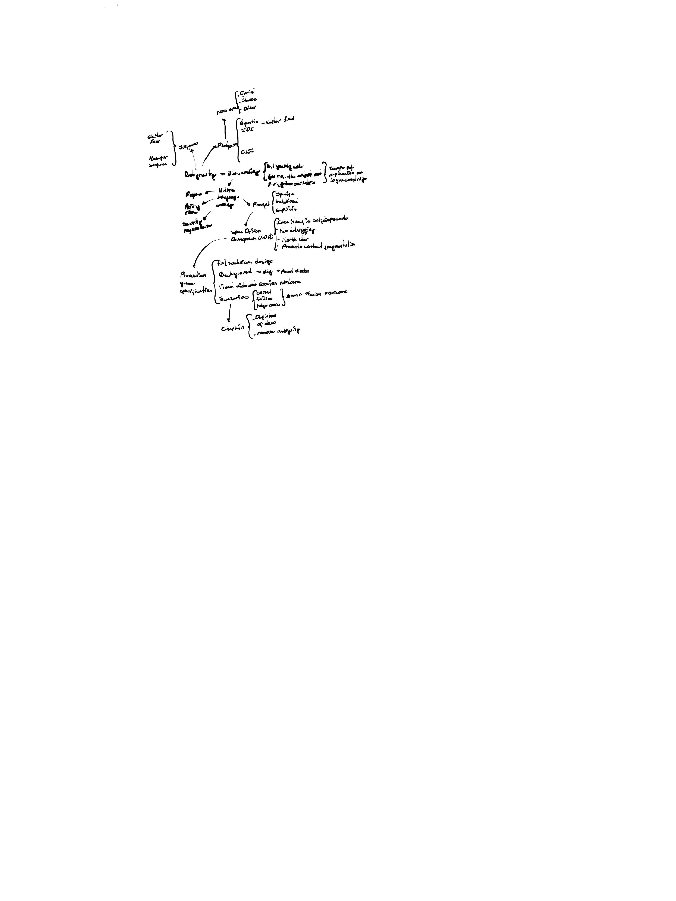

## Platform Architecture Overview

**Editor Tool** and **Human Interface** are grouped together under a curly brace labeled **Software**, which connects to → **Platform**.

---

## Focus Areas (`foco on`)

- **Content**
- **Chunks**
- Other

---

## Platform Branches

### Agentic + Editor Flow
- **IDE**
- **Cuts**

### Design Top → Discovery
- **U:** requirements
- Playground
- Language

### Inputs & Integrations
- **Papers** ←
- **API** and tools

### Visual Layer (U: visual)
- Mappings
- Configs
- → **Prompts**
  - Opacity
  - Solutions
  - Simplicity

---

## Security & Configuration

> **Security configuration** connects to the open **Option / Components (MOD)** node.

**Open Option / Components (MOD):**

| Consideration | Description |
|---|---|
| Similarity to existing approaches | Evaluate overlap with prior solutions |
| No debugging | Constraint or design decision |
| Worth it? | Viability assessment |
| Promise content augmentation | Core value proposition |

---

## Production-Grade Specification

*Following the large curved arrow downward:*

- **Full solution design**
- **Background** → big → fewer chunks
- **Visual aids** and iteration minicore
- **Distraction** framework:
  - Current
  - Future
  - Long term
  - → **data-driven framework**

---

## Creation

↓

- Definition of **ideas**
- **Prompt prototyping**

---

## Diagram Reference

> **Auto description:** A hierarchical mind map / flowchart drawn in handwriting. At the top, a branching structure shows `foco on` splitting into Content, Chunks, and Other. Below that, a `Platform` node branches into Agentic+editor flow / IDE / Cuts on one side, and Cuts on another. On the left side, Editor Tool and Human Interface are grouped together under a curly brace labeled Software, which connects to Platform. Below Platform, a tree structure shows Design top → discovery with sub-branches for requirements, playground, and language; Papers and `API y tools` connecting to visual mappings and configs, leading to Prompts with sub-items Opacity, Solutions, Simplicity. A Security configuration node connects to an open Option / Components (MOD) node listing similarity to existing approaches, no debugging, worth it?, and promise content augmentation. A large curved arrow then leads downward to a Production grade specification section, which branches into: Full solution design, Background → big → fewer chunks, Visual aids and iteration minicore, and Distraction (with sub-items Current, Future, Long term) leading to data-driven framework. Finally, an arrow points down to Creation with sub-items Definition of ideas and Prompt prototyping.
