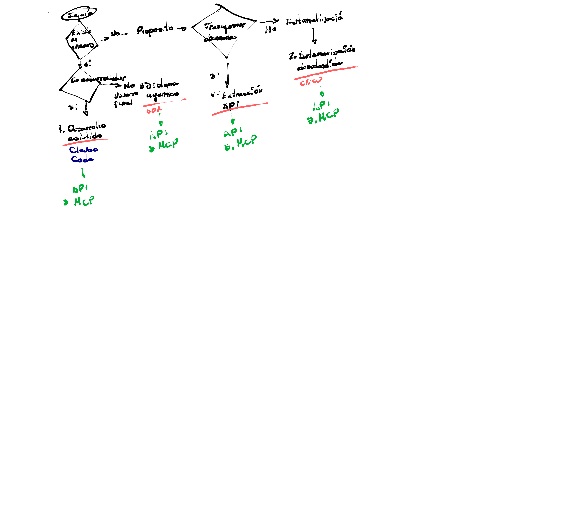

---
certification: CCA-F
confidence: medium
date: '2025-01-01'
keywords:
- Claude Code
- multi-agent system
- autonomous agents
- CLAUDE.md
- plan mode
- glob
- grep
- bash
- tool-use
- batch API
- pipeline
- CI/CD
- structured output
- JSON schema
- hallucination
- non-interactive
- subagents
- coordinator agent
project: ''
status: to-review
tags:
- claude-code
- multi-agent
- CI/CD
- terminal
- automation
- CLAUDE.md
- tool-use
- batch-processing
- agentic
target_folder: 20-Learning/CCA-F
technology: gen-ai
title: Claude Code & Multi-Agent Systems - Architecture Notes
type: lesson-learned
---

non interactivo
Pull request
Automated pipeline
CI/CD
Scheduled job
Automated rerial

Sañales p

Cluster layer 50+
Coordinador agent
Subagente
multi-agent system
wheels
Autonomia

Ability tools
Organizador
Subagentes r/o
Tool-Tool
Diagnosis - Tool-use
add. turn
Initial Jailbreak
Partial Jailbreak
Programmatic arguments
Tool creation
-- nosimo
To correct tipo de error
Agent decisions

Agente 8D+
Operate + demanda
Automated auto-más

Developer en terminal

Claude Code
Developer workflow
Terminal
bash commands
CLAUDE md
Plan mode
codebase

ClaudeMd
Niveles: local/ClaudeMd
Global/ClauDe.md

related relay + glob patterns
Importación condicional

slash/commands/ - equipo
V/claude/commands/ *.md
@import → modularizar
CLAUDE.md
/memory → qué está cargado
/compact → reducir contexto
Plan Mode → multi-archivo
arquitectura
Direct executor → contexto
Dumps

Grop → Busca contenido en
archivos
Glob → Busca archivos por
nombre extensión
Read → Lee archivo completo
Edit → Modifica una línea
Write → Reescribe archivo
completo
Bash → ejecuta comandos
terminal

Built-in
tools

Componentes

4 modos
Claude

Claude Code Terminal

Sañales

Datos

Dataneros
binarios
procesables
0 datos
binarios
extraídos

Principios
fundamentales

Programming + Prompt

nh personal
Dosión independiente
para misión
Inicialización
Error situacional +
anti-patron
Descripción +
mecánica de
orientación

Multipaso → por archivo / integración
Decisión independiente desarrollo la revisión
CLAUDE md-extensiones p/residos pci
Claude - primero -- output format json

Output -- output-format
Parsable json
Componentes → CI/CD
Pipeline

-P
--print → Piloto auto
Mensajes batch API → Jobs nocturnos, no bloqueados
Structured data
extraction
Json schemas
Documents
Tool-use
Batch Processing
Validation
noirs

Tool-use → Json schema → Output
calumnado
generando

Claude decide → Data
Claude OCR serving → Tool Choice
Uso específico forzado

Pruebas Alucinaciones campo nullable → Component
Dato existe mal creído Retry con feedback
Precisión por ejemplo → classified sampling
Consistencia de output → few-shot examples
reducir falsos positivos → criterios explícitos
Archivos grandes → Multi-paso modular

Agente SDKs
Componentes

> **Auto description:** A large, complex hand-drawn mind map centered on 'Claude Code Terminal' with multiple branching topics in different colors. The map radiates outward in all directions with the following main branches: 1) RED branch (upper left) - covers CI/CD pipelines, automated processes, pull requests, batch API, structured data extraction, JSON schemas, and multi-step processing. 2) PINK/RED branch (upper center) - covers señales (signals), process automation, and 4 modes of Claude including non-interactive and scheduled jobs. 3) GREEN branch (upper right) - covers Agent SDKs, multi-agent systems, cluster layers, coordinators, subagents, ability tools, organizer patterns, tool-to-tool communication, and agent decisions. 4) DARK BLUE/NAVY branch (right center) - covers Developer workflow in terminal, Claude Code, bash commands, CLAUDE.md, plan mode, codebase navigation, slash commands, glob patterns, @import, /memory, /compact, and direct executor. 5) DARK BLUE branch (bottom right) - covers Built-in tools including Grep (search file contents), Glob (find files by name/extension), Read (read complete files), Edit (modify single lines), Write (rewrite complete files), and Bash (execute terminal commands). 6) BLUE branch (center/left) - covers Components including ClaudeMd levels (local/global), related relay, slash commands for teams, modularizing CLAUDE.md, memory management, compact context reduction, Plan Mode for multi-file architecture. 7) ORANGE branch (center left) - covers Principios fundamentales (fundamental principles), Programming + Prompt, personal initialization, independent decision, error situation, anti-patterns, description and orientation mechanics. 8) PURPLE branch (left/bottom left) - covers Component testing, hallucination tests, nullable fields, retry with feedback, precision by example, classified sampling, few-shot examples, consistency of output, false positive reduction, explicit criteria, and multi-step modular processing for large files. The mind map uses color coding to distinguish different topic areas and shows hierarchical relationships through branching lines.
