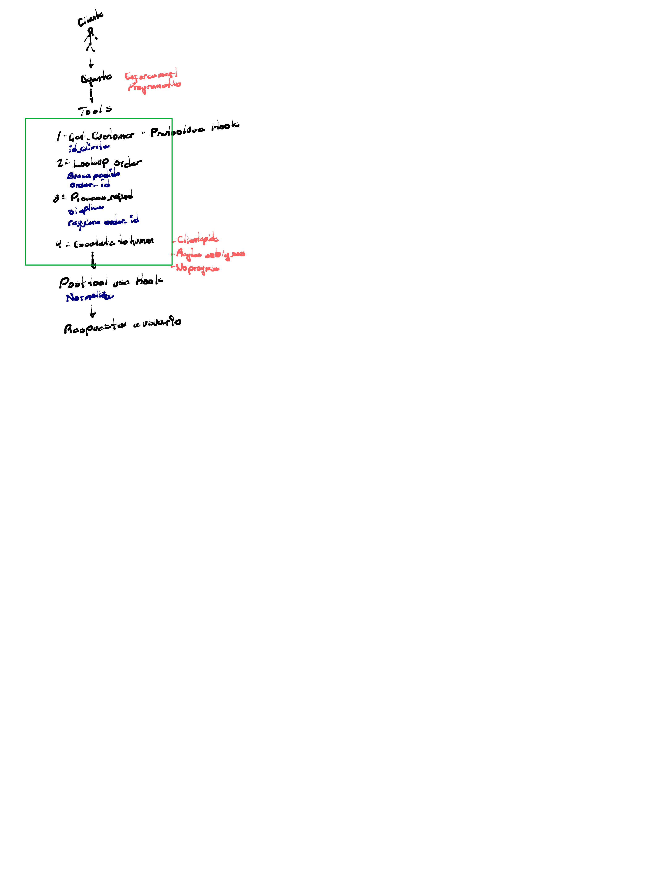

Cliente
↓
Agente    Capacidades
           Programadas
↓
Tools

1. Get Customer - Predefined Hook
   id_cliente
2. Lookup order
   Busca pedido
   order_id
3. Process_refund
   pipeline
   requires order_id
4. Escalate to human    - Claridades
                        - Algo ambiguo
                        - No pregues
↓
Post tool use Hook
Normalizar
↓
Respuesta usuario

> **Auto description:** A vertical flowchart showing the flow from a stick figure labeled 'Cliente' (Client) down to an 'Agente' (Agent) node annotated with 'Capacidades Programadas' (Programmed Capabilities) in red, then down to 'Tools'. Inside a green-bordered rectangle, four numbered tools are listed: 1. Get Customer (with id_cliente in blue), 2. Lookup order (with Busca pedido and order_id in blue), 3. Process_refund (with pipeline and requires order_id in blue), and 4. Escalate to human (with red annotations: Claridades, Algo ambiguo, No pregues). An arrow exits the box downward to 'Post tool use Hook / Normalizar' and then to 'Respuesta usuario' (User Response).
