Martes

En control | Fuera de mi control

- Buscar trabajos que me gusten y cumplan mi expeditiva
- Distractores como Amazon, twitter, Bumble, Facebook, WD, Youtube
- Mi agenda
- Mejorar mi presencia, hacerla atractiva
- Generar contenido de gran valor.

Depende de mi Valorarme.

| - Recibir llamadas de reclutadoras que ni al caso
- Llamadas entrantes no programadas
- Asuntos no planeados
- Sucesos políticos
- Chismes, rumores y opiniones
- Likes de Bumble, LinkedIn
- Que abran mi CV al postularme a nuevas vacantes.

No los puedo cambiar

Dentro          Miércoles          Fuera

- Comer mal     - Correos con Etsy  }
- Ver película  - Respuestas de Etsy } 30min
- Twitter 2hr   - Silla en Costco   }
- Bumble {tiempo - Cajota             } 1hr
- Whatsapp      - Platicar/Coincidir con
- No leer         Estefanía -1hr
- No tésis
- Trabajar                    { - Desempleo
  de verdad    Aversiones { - Pobreza
                            { - Rechazo

Trabaja         Podcast - R
enti y          LinkedIn → R
deja de         Buscar trabajo → D+P+R
pajarear        Tesis - D - R - P
                Marca personal - R - D - P
                Contenido - D - P - R
                Buenas entrevistas - D R P

Dentro    ✱Viernes    Fuera

- Uso de mi
  tiempo

- twitter
- Bumble
- Facebook
- Dicta

-

                    - BNI y sus demandas
                    - Necesidades de Merzig
                    - Tráfico
                    - Federico
                    - Llamadas no agendadas

                    - Construir, bien, bonito,
                      con amor, hacer lo que
                      amas trae beneficios
                    - Posiblemente tarda, pero
                      llega...

Aversiones { Desempleo
           { Pobreza
           { Rechazo

Control                    Fuera de mi control

- Buena              2- Contratación
  entrevistan  ←  3- Que se enamoren de mí
- Prepararme  ←
- Ser asertivo ↓    - Llamada con Amy, ella
- responder bien       lideró y no tuve mucho
                       que decir

- Mejorar el ← Rechazo  - Lo que Emilio entendió
  podcast      Rechazo
- Redacción
- Gramática
- Retórica

Lo que yo quiero ↓  Rechazo    F + C
                              Lo que Emilio sugiere
                              dicotomía del
                              control
hacer
I + C                         lo que puedo
lo que                      ← controlar
importa

                   foco

Control
-Preparar la entrevista
-Tesis Trabaja
-Podcast
-Contenido
-Merzio
Bumble Match.

Fuera de mi control
-Política (Acepta)
-Bumble match
No habla

Importa

Prime
Youtube
Elimina

Coches
Twitter
Facebook
Bumble likes

Elimina

No importa

Haz lo mejor que puedas, no eres perfecto,
solo haz lo mejor y ellas decidirán.
Lo único malo podría ser que hugas o
hagas las cosas al aventón que no
te conectes, hoy tienes el 33%, mañana
vas a tener mayores posibilidades

Observa la forma en la que llegan las oportunidades poco a poco y sin sufrir,

débes dejar que todo fluya y en cuestión de tiempo vas a estar en el camino correcto

Solo eres un hombre, no eres perfecto, hoy van a ver si tienes lo que buscan y NO necesitas tener lo que ellos buscan, lo importante es lo que eres y ellos tienen la oportunidad de decidir si eres suficiente para ellas o no.

Terminar las entrevistas de hoy es ganar, independientemente de si te quedas con el puesto o No

Lo hiciste muy bien, mejor
de lo que esperabas, mejor de
lo que planeaste

te preparaste para lo peor
y te preocupaste para una
electrocución y al final
en lo técnico fuiste
sobresaliente, como persona
estudiste bien, el idioma
es el punto débil

Hiciste todo ya ga,
suelta, ya no depende de
ti, ya cumpliste.

Control                    Fuera

Mi actitud             Decisión de Etsy
Mi energía
Mi dedicación
Mi esfuerzo
Mi disciplina

Controlar mi           Encontrar trabajo
agenda
                           Encontrar cliente
Establecer y
Trabajar en
mis prioridades

- Mis gastos

Trabajar duro
- Generar contenido
- Desarrollar
  mi marca
  personal

Preocupaciones semana

Panamá
Etsy

Panamá

Estás poniendo de tu parte,
Iris no te está ayudando y
podría caerse el negocio a
Iris, entonces, tu tranquilo,
no es tu prospecto, y si
esto no jala, es Iris, solo
ayuda y no la dejes sola

Etsy
Ya lo hiciste y lo hiciste
bien, falta una entrevista
pero ya es todo, ya
cumpliste y ahora es tiempo
de dejar que ellos hagan su
parte.

- Haz las cosas bien
- Haz las cosas con amor
- Haz las cosas a tu manera
- Siente orgullo por lo que haces
- Respeta tu tiempo / valor
- Disciplina y Trabajo constante

Etsy, Panamá y Chubb
Vas bien, muy bien, en las tres eres competitivo,
como empleado te quedas chico, como consultor un poco grande pero en todos los casos son retos
NYC remoto, Panamá, Monterrey son cambios fuertes, es curioso, ninguno es en CDMX.

a) Eres bueno y la gente lo sabe
b) Eres bueno y lo sabes
c) Si no te quedas en los tres, no pasa nada, ni tienes prisa ni es el fin del mundo, tu valor no se define por un puesto.

Trabajo para la semana

-Tesis.
-Copy-Writing
-Generar valor
-Contenido
-Buscar trabajo

Semana con mucho por venir
Mañana Andoni, no hiciste
varias tareas.

Miércoles de ETSY, es el
cierre, sigue haciendo
tu parte, cumple y cierra
el ciclo, vas bien,
termina bien y listo
la decisión no depende de
ti

- Martes de Mentorías,
haz buenos análisis,
propuestas, pero no te
enganches, esto no es tu
rollo

Francisco Nasta
No puedo decir que me haya
hecho algo, simplemente es
una persona que sobre
promete y entrega muy por
debajo.

No me siento maltratado, solo
que es una persona de la que
esperaba honestidad.

En este momento me da igual
su vida.

Piens que hace todo esto por
hambre, por necesidad.

Yo he actuado así, selecciono
trabajos, por hambre, por dinero
o necesidad

Lo entiendo, yo también ando
Correteando la chuleta.

BNI

- No me ha dado nada, solo disponen de mi tiempo, y si bien no es tiempo tirado, tampoco es tiempo bien invertido.

- No es mal trato, solo siento que piden y exigen sin retribución. Siento que no vale la pena ni mi tiempo.

- Hacen todo esto porque no tienen ni idea de lo que hacen ni un objetivo definido, solo van navegando de muertito.

- Yo también uso a las personas no soy pan de Dios, pero no es lo mismo que yo use a que otros me usen.

S1-Sueño y Dieta

- No chatarra
- 6:00 a diario

S2-Ejercicio diario e Inglés
- Pesas
- Estudiar a diario
    Inglés X 1 hora al meno[s]

Hiciste todo, Forma y fondo respondiste bien, fuiste asertivo, inteligente, hiciste gala de tu experiencia, fuiste afable, y ahora, todo depende de etsy. Tú ya cumpliste deja que ellos decidan y si optan por algen mes es su decisión, tu hiciste todo.

BnB

Me molestan las exigencias,
sus procesos mediocres y
tienen razón yo no he hecho
todo lo que me corresponde
ni ellos, entonces estamos a
mano.
Deja pasar todo esto,
cumple hasta dónde puedas
con tu compromiso y ya
está, deja ir esto que
termina siendo irrelevante,
si quieres, no te presentas
mañana, esto es temporal
y está a unos meses de
terminar.

Es hora de buscar trabajo,
llevas una semana sin
postularte, cy lo de ETSY
lleva semana y media...
no depende de ti lo de
ETSY, pero sí depende de
ti buscar trabajo o
clientes y te estas
durmiendo en tus laureles

___________________________

Han sido seis semanas
desde el primer contacto
con ETSY y esta aún no
termina, ni con un aceptado
ni con el famoso correo
diciendo que eres el mejor,
pero no eres suficiente para
ellos.

Ahora bien, ya cumpliste, hiciste todo, fuiste tu mismo e hiciste una gran entrevista, bueno, muchas buenas entrevistas. Ahora pueden suceder dos cosas:

a) Ellos deciden contratarte

b) Ellos deciden no contra-
   tarte

En ambos casos, ninguna de las dos opciones se encuentran en tus manos. Son sus decisiones, son sus razones, no puedes influir o forzar.

Suelta ya, si te toca, ni aunque te quites, si no te toca, ni aunque te pongas.

ya está, no sabes nada de ETSY, y no puedes hacer nada con ellos, pero sí puedes hacer lo que a ti te corresponde, actualizar tu CV, buscar trabajo y seguir preparándote y exponiéndote o dándote a conocer ante el mundo
Tus acciones son simples

a) Tesis
b) Publicar contenido { Blog
                        { Podcast
c) Actualizar CV
d) Buscar trabajo
e) Webinar

Poco flujo de efectivo

- En el tiempo, yo estoy bien, posiblemente con más dinero que nunca, termino cada mes con dinero y tengo para alrededor de cinco meses.

- Millones de personas tienen menos que yo
- Millones de personas tienen problemas peores
- Tengo techo, comida, tengo todo para vivir bien tengo más que la mayoría de los habitantes de este planeta

Vender
Seguir la
ruta que
dimos y
tengo en
Trello

No me han llamado de ETSY

Te han rechazado mil veces
de mil empresas, entonces
uno más o uno menos, da
igual

No vendes nada-
Te das a conocer pero sin
un call to action
Vas a poner al final un
link a tu calendly y
copy enfocado a la
acción.
Importa por ser fuentes
de ingreso que dejas
pasar.
Impota porque vender sin
vender no funciona
rápido

Training
+
Mentalidad
Control

{ Vivir saludablemente es vivir de acuerdo con las leyes de la naturaleza

- El universo es un sistema vivo y racional
- Existe orden, estructura y wholeness
- Dios esta presente en todo (Panteísmo)
- El universo es providencia

En mi
control

Desempeño
Negativas
{ Opiniones → Sobre mi → Positivas
  Emociones → Negativas → Positivas
  Actitudes ↓ Rechazo, → Positivas
             miedo
             Ansiedad

Reacción - Inconsciente
- Va al exterior
- Defensivo
- Ataca
- Sedar o controlar la situación desagradable
- Sentimiento culpa o venganza

Respuesta - Consciente
- Interiorizar constructivamente
- Busca integrar y liberar nuestra inconsciencia.
- Responsabilidad.

Reconozco mis reflejos en el mundo

Lo que veo a mi alrededor es un reflejo de lo que tengo en mi interior
Reacción = Proyección del pasado

> **Auto description:** A hand-drawn table with a title 'Martes' (Tuesday) at the top, divided into two columns by a vertical line and enclosed in a rectangular border. The left column is labeled 'En control' (In my control) and lists items the writer can control, such as job searching, avoiding distractions, managing their agenda, improving their online presence, and generating valuable content. The bottom left cell contains a note about depending on oneself and self-worth. The right column is labeled 'Fuera de mi control' (Out of my control) and lists things beyond the writer's control, such as unsolicited recruiter calls, unplanned incoming calls, unplanned matters, political events, gossip/rumors/opinions, likes on Bumble and LinkedIn, and whether recruiters open their CV. The bottom right cell notes 'No los puedo cambiar' (I cannot change them). The table has hand-drawn borders separating the header row from the content rows and the bottom summary row.

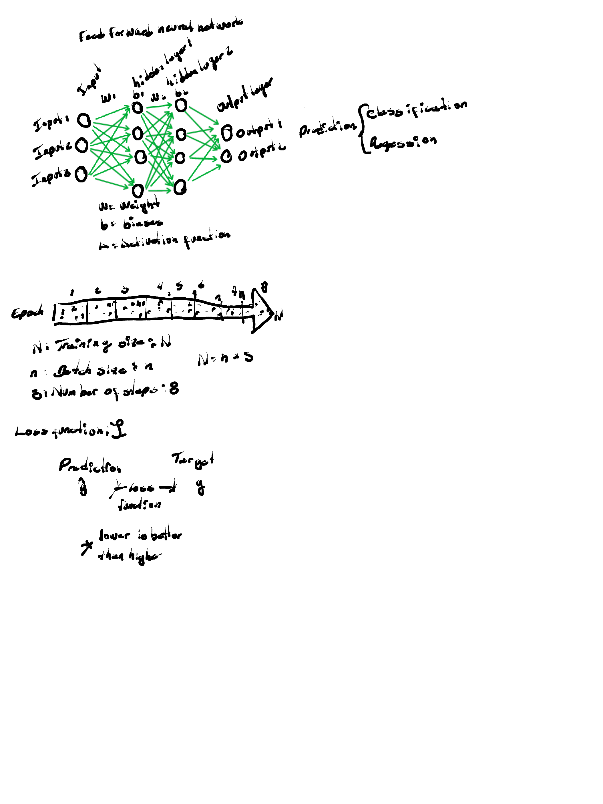
> **Auto description:** A hand-drawn table with three columns labeled 'Dentro' (Inside), 'Miércoles' (Wednesday), and 'Fuera' (Outside). The table has two rows divided by a horizontal line. The top section contains lists of behaviors/activities under each column. The 'Dentro' column lists negative behaviors (eating badly, watching movies, Twitter, etc.). The 'Miércoles' column lists tasks with time allocations (Etsy emails: 30min, Costco chair/Cajota: 1hr, meeting with Estefanía: 1hr) and 'Aversiones' (aversions) branching into Desempleo, Pobreza, Rechazo. The bottom section has motivational text on the left ('Trabaja en ti y deja de pajarear') and a list of goal-related activities on the right with letter codes (R, D, P).

> **Auto description:** A curly brace/bracket drawn on the right side grouping 'Correos con Etsy' and 'Respuestas de Etsy' together with a '30min' label, and another bracket grouping 'Silla en Costco' and 'Cajota' together with a '1hr' label. A curved arrow connects these grouped items.

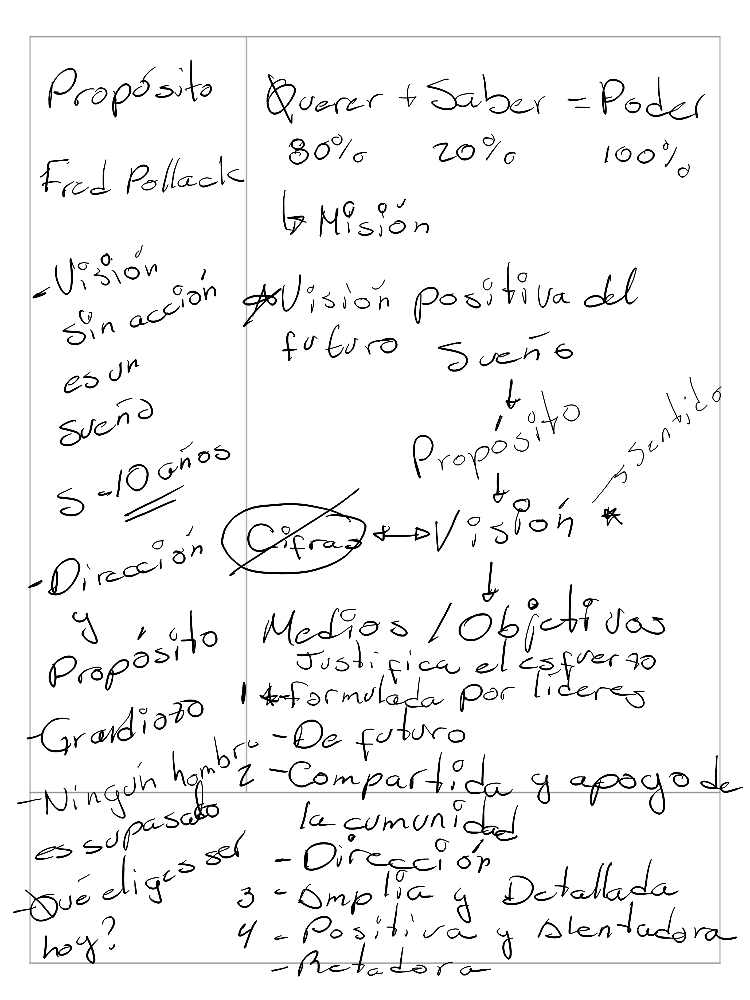
> **Auto description:** A hand-drawn branching diagram where the word 'Aversiones' connects via curly braces to three underlined items: 'Desempleo' (unemployment), 'Pobreza' (poverty), and 'Rechazo' (rejection), representing fears or aversions.

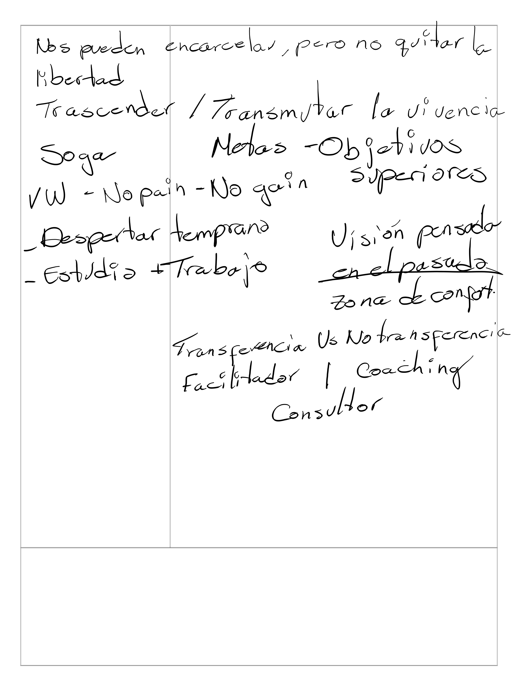
> **Auto description:** A hand-drawn two-column table divided by a vertical line with a horizontal line separating an upper section from a lower (empty) section. The top header row contains three labels: 'Dentro' (left column, meaning 'Inside'), '✱Viernes' (center/star marker, meaning 'Friday'), and 'Fuera' (right column, meaning 'Outside'). The left column lists items within one's control (time use, social media apps). The right column lists external factors and reflective notes. The bottom section of the table is blank.

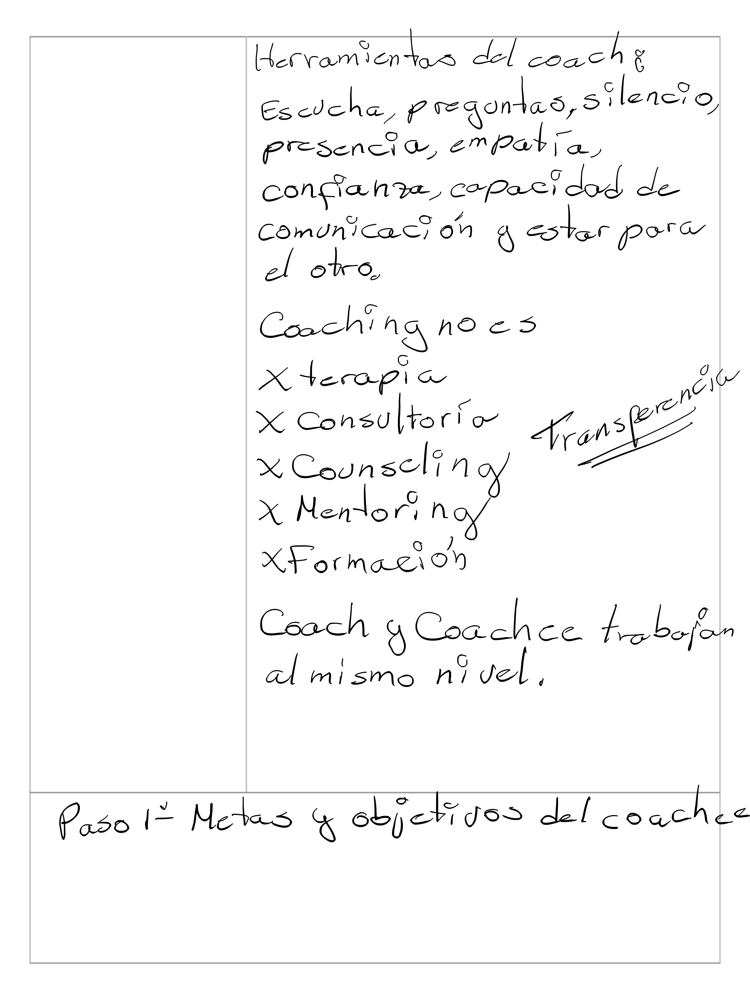
> **Auto description:** A hand-drawn table divided by a vertical line into two columns. The left column is labeled 'Control' and lists things the writer can control (good interviews, preparing, being assertive, responding well, improving the podcast, writing, grammar, rhetoric). The right column is labeled 'Fuera de mi control' (Outside my control) and lists things outside their control (hiring/contratación, that someone falls in love with them, what Amy understood during a call she led, what Emilio understood). Arrows connect items between the two columns, indicating relationships or movement between controllable and uncontrollable elements.

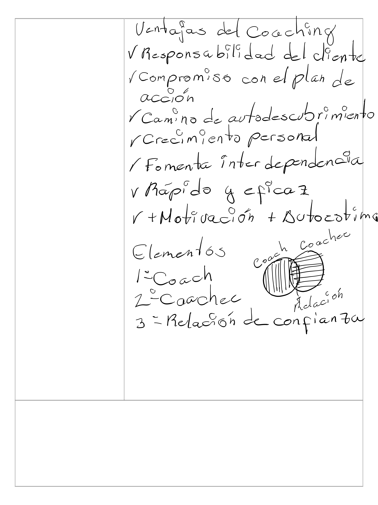
> **Auto description:** A hand-drawn Venn diagram at the bottom of the page showing two overlapping circles. The left circle is associated with 'hacer I+C' (do I+C) and 'lo que importa' (what matters). The right circle is associated with 'lo que puedo controlar' (what I can control). The overlapping intersection area is shaded/hatched and labeled 'foco' (focus) below it, indicating that the focus should be on the intersection between what matters and what one can control.

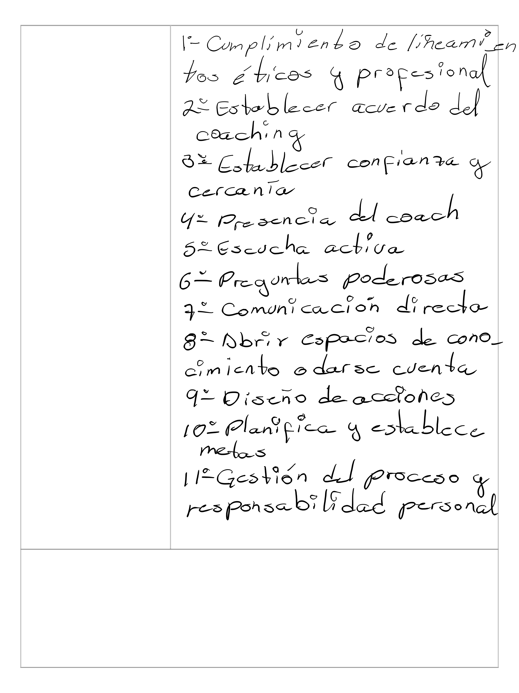
> **Auto description:** A hand-drawn 2x2 matrix (four-quadrant grid) with two axes. The vertical axis on the left is labeled 'Importa' (top half) and 'No importa' (bottom half), indicating importance. The horizontal axis divides the grid into 'Control' (left column) and 'Fuera de mi control' (right column), indicating degree of personal control. The four quadrants contain: Top-left (Important & In Control): preparing interview, thesis/work, podcast, content, Merzio, Bumble Match; Top-right (Important & Out of Control): Politics (Accept), Bumble match not talking; Bottom-left (Not Important & In Control): Prime, YouTube — marked 'Elimina'; Bottom-right (Not Important & Out of Control): Coches, Twitter, Facebook, Bumble likes — marked 'Elimina'. Below the matrix is a motivational note written in Spanish.

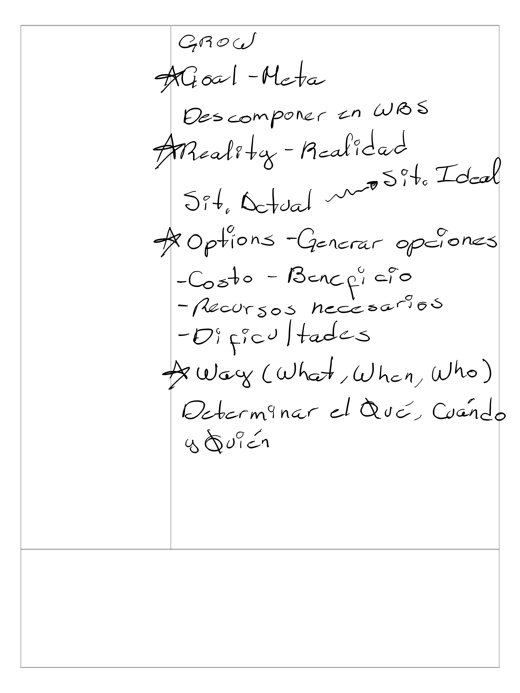
> **Auto description:** A hand-drawn table with two columns separated by a vertical line and enclosed by a rectangular border. The left column contains motivational advice about observing how opportunities arrive little by little without suffering, and letting things flow to eventually be on the right path. The right column contains encouragement about being imperfect but authentic, not needing to have what others are looking for, and that completing today's job interviews is already a win regardless of the outcome.

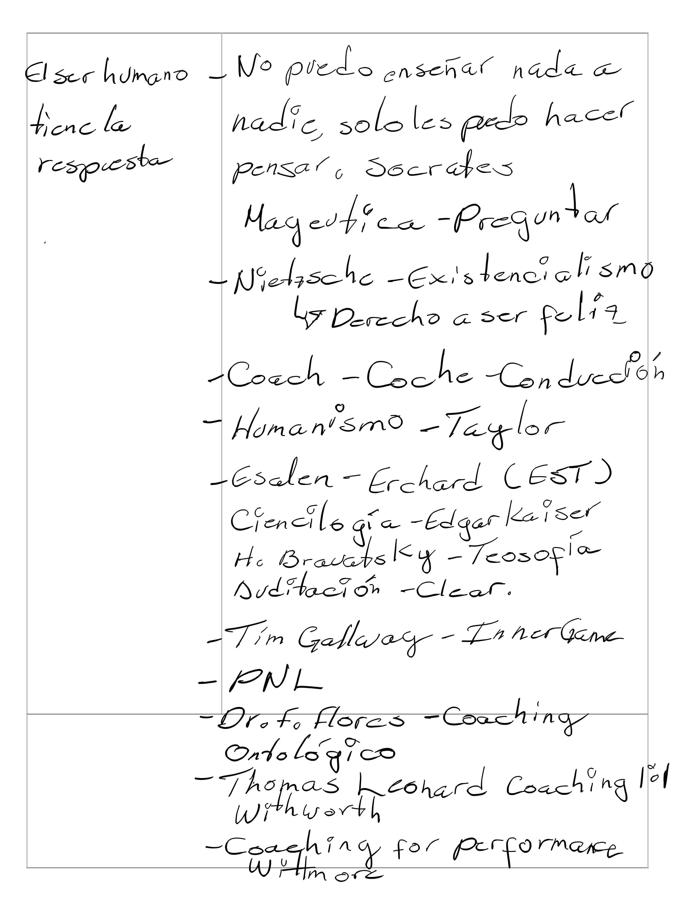
> **Auto description:** A hand-drawn two-column table with a vertical dividing line and horizontal section dividers. The left column is labeled 'Control' and the right column is labeled 'Fuera' (Outside). The table is divided into two main rows/sections by a horizontal line. The top section lists personal attributes under Control (attitude, energy, dedication, effort, discipline) and one item under Fuera (Etsy's decision). The bottom section lists actionable items under Control (managing agenda, establishing and working on priorities, expenses, working hard, generating content, developing personal brand) and two items under Fuera (finding work, finding clients). The structure represents a personal reflection exercise distinguishing what is within one's control versus outside of it.

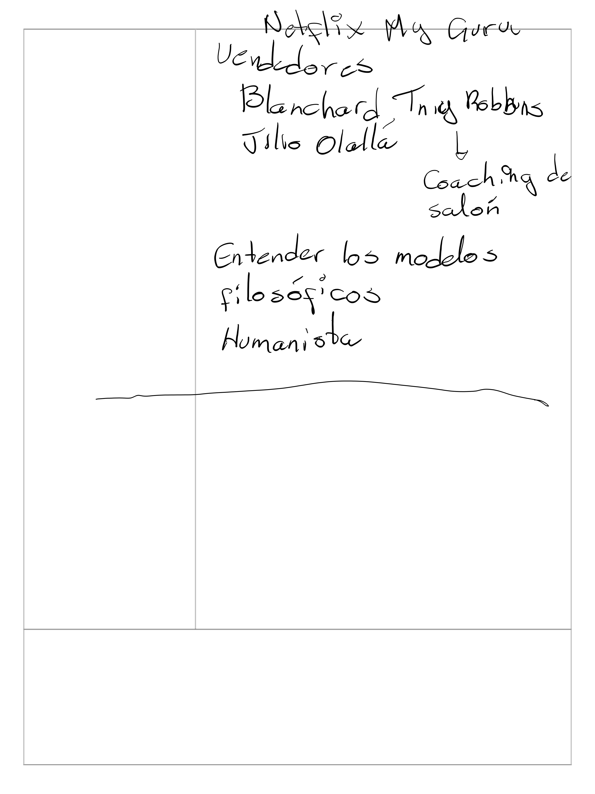
> **Auto description:** A hand-drawn table or structured journal entry with a title at the top ('Preocupaciones semana' meaning 'Weekly Worries/Concerns'). The layout has a left column that appears blank or used as a margin, and a right column containing the written content. A horizontal line divides the lower portion of the page into a second row. The structure resembles a simple two-column, two-row table drawn with straight lines.

> **Auto description:** A hand-drawn table with two columns separated by a vertical line and enclosed by a rectangular border. The left column contains a bullet-point list of personal principles or values (do things well, with love, your way, feel pride, respect your time, discipline and constant work). The right column contains a longer paragraph of reflective notes about job opportunities at Etsy, Panamá, and Chubb, along with three labeled points (a, b, c) offering perspective on self-worth and career decisions. A horizontal line at the bottom separates a continuation of the right column's text.

> **Auto description:** A hand-drawn table with two columns and two rows (the bottom row is empty). The left column contains a list of weekly work tasks under the heading 'Trabajo para la semana', including items like Tesis, Copy-Writing, Generar valor, Contenido, and Buscar trabajo. The right column contains motivational and planning notes about the week, referencing specific days (Mañana/Monday, Miércoles/Wednesday for ETSY, Martes/Tuesday for Mentorías) with advice and reminders. The table borders are drawn with straight lines.

> **Auto description:** The notes are written inside a drawn table or grid with visible borders. There are at least two rows visible: the upper section contains the handwritten text content, and the lower section is blank. A horizontal underline/divider is drawn beneath the last bullet point within the upper cell, separating content from empty space.

> **Auto description:** The note is written inside a two-row table with drawn borders. The top cell contains the handwritten text. The bottom cell is empty. The table has a simple rectangular border dividing the page into two sections.

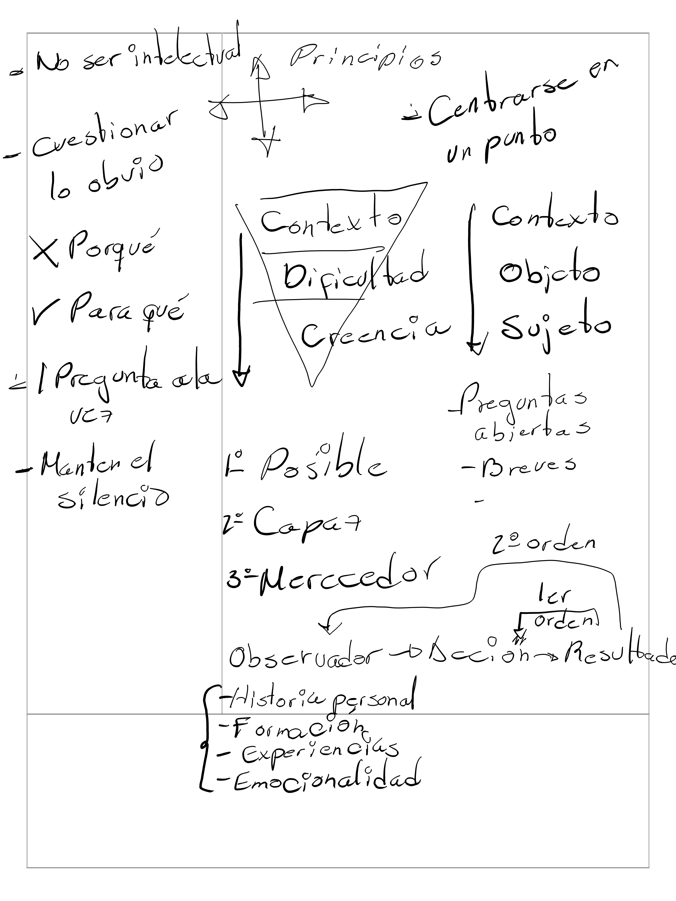
> **Auto description:** The image shows a hand-written note divided into two sections by drawn rectangular borders. The upper section contains the main body of the text about job interviews and outcomes. The lower section, separated by a horizontal line, contains a concluding philosophical statement about letting go. The borders are simple straight lines forming a table-like structure with two cells stacked vertically.

> **Auto description:** A series of bold diagonal and vertical pen strokes drawn to the left of the action list (a through e), serving as a visual emphasis marker or bullet-like indicator highlighting the importance of the listed actions.

> **Auto description:** A simple two-column hand-drawn table layout. The left column contains the heading/action item 'Vender - Seguir la ruta que dimos y tengo en Trello' with a diagonal line/slash drawn below it. The right column contains the main notes and bullet points. There is also a horizontal line drawn in the right column separating the first section (about ETSY and rejections) from the second section (about selling and call to action). The bottom row spans the full width and contains the final notes about selling.

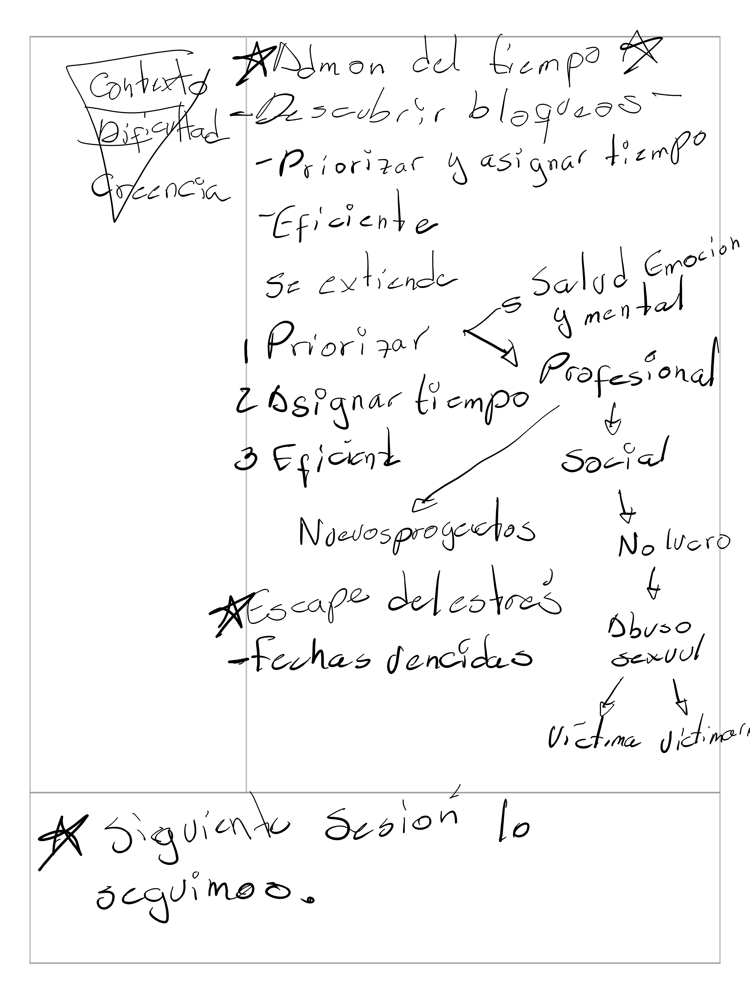
> **Auto description:** A curly brace on the left groups together 'Training + Mentalidad' and 'Control' (each underlined), linking them to the definition text on the right: 'Vivir saludablemente es vivir de acuerdo con las leyes de la naturaleza.'

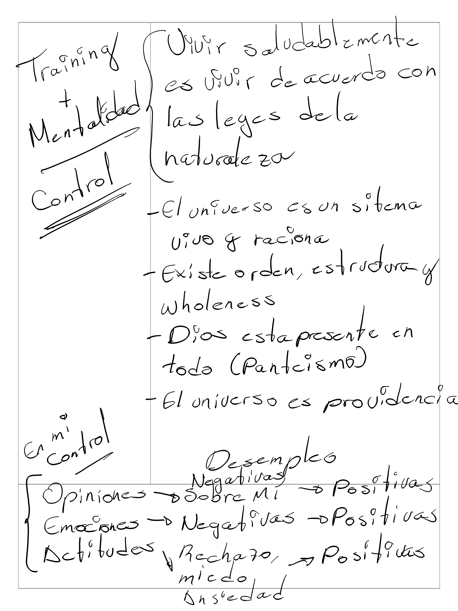
> **Auto description:** A curly brace on the left groups three items: 'Opiniones', 'Emociones', and 'Actitudes'. Each has arrows pointing rightward showing a transformation from negative states to positive ones. 'Opiniones' → 'Sobre mi' → 'Positivas'; 'Emociones' → 'Negativas' → 'Positivas'; 'Actitudes' → (downward arrow to) 'Rechazo, miedo, Ansiedad' → 'Positivas'. Above this cluster is the label 'Desempeño' with 'Negativas' written below it, suggesting a flow from negative performance/states toward positive outcomes.

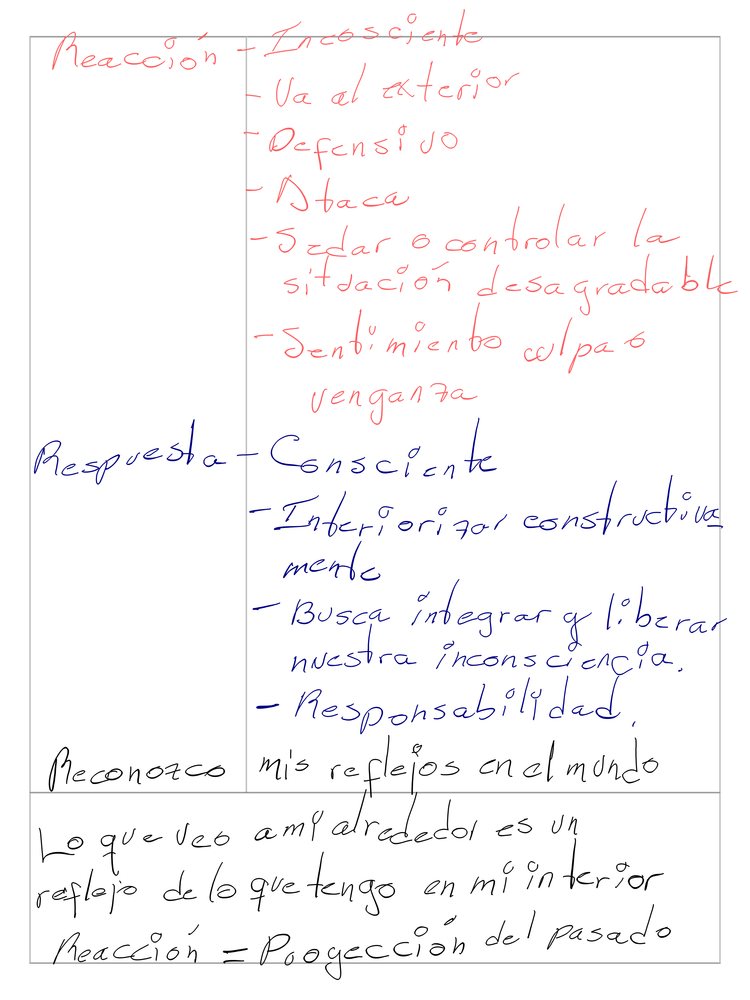
> **Auto description:** A hand-drawn table with visible border lines dividing the page into sections. The upper portion contains two rows with two columns each: the left column has the key terms ('Reacción' written in red/pink and 'Respuesta' written in blue), and the right column lists bullet-point characteristics for each term. 'Reacción' (in red) is associated with unconscious, defensive, attacking behaviors and negative feelings. 'Respuesta' (in blue) is associated with conscious, constructive, integrative and responsible behaviors. A third row spans the full width with the phrase 'Reconozco mis reflejos en el mundo'. Below the table, outside it, two concluding statements are written about the world being a reflection of one's inner self and reaction being a projection of the past.
