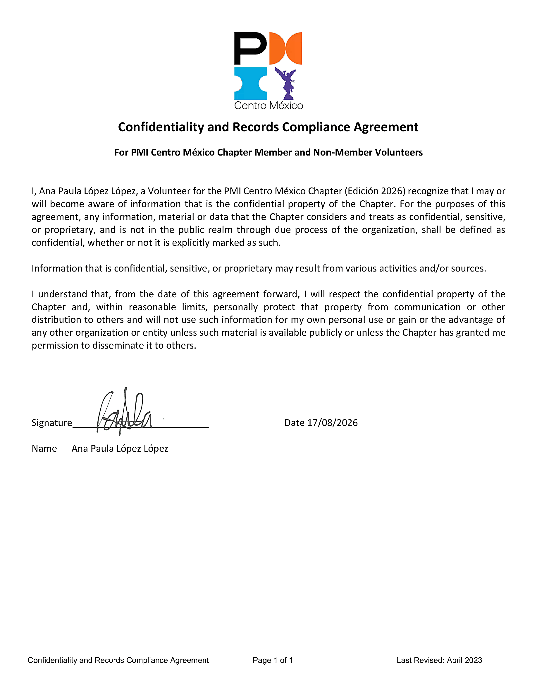

## Acuerdo de Confidencialidad y Cumplimiento de Registros

**Para Voluntarios Miembros y No Miembros del PMI Centro México Chapter**

---

### Datos del Firmante

| Campo | Detalle |
|---|---|
| **Nombre** | Ana Paula López López |
| **Rol** | Voluntaria — PMI Centro México Chapter |
| **Edición** | 2026 |
| **Fecha de firma** | 17/08/2026 |

---

### Declaración de Confidencialidad

Yo, **Ana Paula López López**, Voluntaria del **PMI Centro México Chapter** (Edición 2026), reconozco que puedo o podré tener conocimiento de información que es propiedad confidencial del Chapter.

> **Definición de información confidencial:** Cualquier información, material o dato que el Chapter considere y trate como confidencial, sensible o propietario, y que no se encuentre en el dominio público a través del proceso debido de la organización, se definirá como confidencial, independientemente de si está o no explícitamente marcado como tal.

La información confidencial, sensible o propietaria puede provenir de diversas **actividades y/o fuentes**.

---

### Compromisos Adquiridos

A partir de la fecha de este acuerdo, me comprometo a:

- **Respetar** la propiedad confidencial del Chapter
- **Proteger personalmente**, dentro de límites razonables, dicha propiedad frente a su comunicación o distribución a terceros
- **No utilizar** dicha información para beneficio personal propio, ni en ventaja de ninguna otra organización o entidad

**Excepciones aplicables:**

- Que el material esté disponible públicamente, **o**
- Que el Chapter me haya otorgado permiso expreso para difundirlo a terceros

---

### Firma

| | |
|---|---|
| **Firma** | *(firma estilizada — ver nota OCR)* |
| **Nombre impreso** | Ana Paula López López |
| **Fecha** | 17/08/2026 |

> ⚠️ **Nota OCR:** La firma manuscrita es estilizada y no completamente legible como letras específicas; el nombre impreso `Ana Paula López López` se proporciona debajo de ella.

---

### Identificación Visual del Documento

> **Descripción del logo:** Logotipo del PMI Centro México Chapter compuesto por las letras `PM` en negro y naranja, una forma de reloj de arena/cinta en azul, y una figura morada del ángel de la independencia, con el texto `Centro México` debajo.

---

*Confidentiality and Records Compliance Agreement — Página 1 de 1 — Última revisión: abril 2023*
